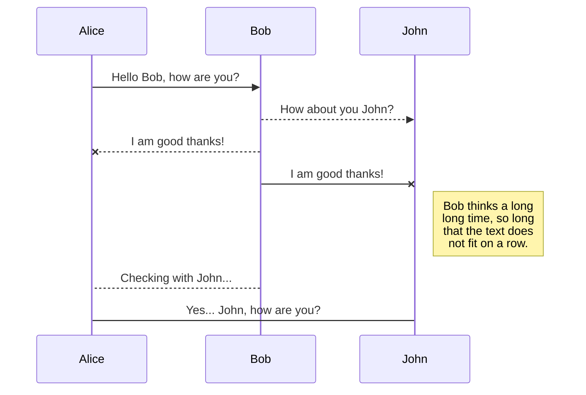
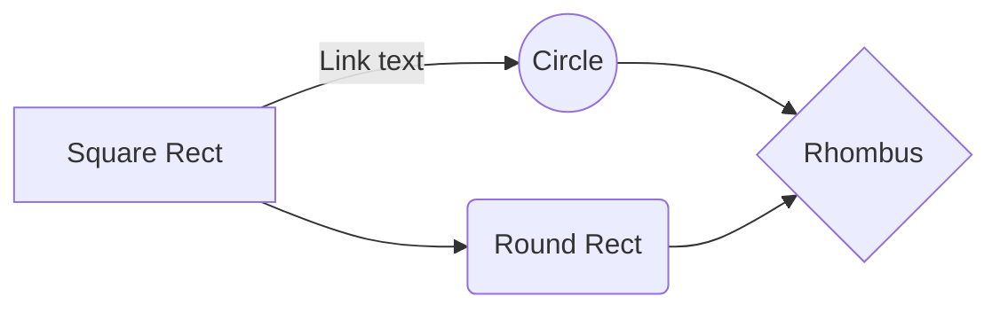

# Arquitectura Blockchain empleando contenedores para su enseñanza.

Este proyecto está concebido por la iniciativa de dar a conocer y apoyar  el proceso de formación en tendencias tecnologicas como la industria 4.0 en éste caso referentes a Blockchain. Teniendo como bases, el aporte desde el ámbito educativo de un estudiante de Tecnología en Redes de computadores y seguridad informática de la Universidad Minuto de Dios, así como el docente encargado de dar guía y apoyar el proceso de construcción del mismo. (Para éste proyecto se tomó como referencia la fuente https://github.com/lhartikk/naivechain).

# Qué es Blockchain?

Blockchain o cadena de Bloques en español, es un protocolo conformado    por una serie de tecnologías basadas en P2P (Peer-to-peer),    criptografía de clave pública y time stamping (sellado de tiempo).    Blockchain funciona como una base de datos descentralizada en donde    la información está distribuida entre todos sus nodos. Estos nodos    conectados se encargan de validar y llevar a cabo operaciones de    transferencia de activos o bienes digitales.

En el momento que un nuevo nodo se una a la red, todas transacciones u operaciones ya registradas se descargan en él. La distribución de la información por la red se consigue mediante el uso de la tecnología P2P. El nombre de esta tecnología se refiere a la forma como se almacena la información. Blockchain crea distintos bloques y los une formando una cadena inmutable y creando una lógica de conexión que depende de la información contenida en los propios bloques, consiguiendo así un blindaje para el sistema evitando la modificación de estos, pues si se genera la más mínima afectación se rompe la seguridad y esto hace que pierda su conexión con los demás. Para validar y/o confirmar cada una de las transacciones se necesita un consenso de todos los nodos y con esto se elimina la centralización de las decisiones o la necesidad de tener un tercero certificador, dueño de las decisiones y el cual, genera un cobro de transacción.

Blockchain permite que todas las operaciones sean verificadas por cualquier nodo en la red, pues todas tienen uso de firmas con claves privadas de cada uno de los usuarios. Cuando se conoce la clave pública del usuario se puede determinar si el mensaje ha sido cifrado por su clave privada, pero la información no podrá ser modificada y firmada por otro al no tener su clave.

# Herramientas

Para el desarrollo de éste proyecto se ha tenido en cuenta la utilización de herramientas tecnológicas en dos vías:

La primera de estas es el ambiente de desarrollo de la app que garantizará la interacción de los usuarios con la misma y con la cual podrán llevarse a cabo escenarios de enseñanza y prácticas de entendimiento de la misma. **Ver Readme bc_app**. 

La segunda está enfocada en determinar la arquitectura del proyecto y con el cual podrá realizarse una distribución o replicación determinada por el tutor encargado de la misma. Se considera la elaboración como una guía facil en cuanto a su interpretación y y posible interacción de los usuarios quienes accedan a ella.  **Ver Readme develop**. 

## Estructura Blockchain Uniminuto

Esta estructura es de caracter educativa y se elaboró con 
- Interfaz HTTP para controlar el nodo
- Use Websockets para comunicarse con otros nodos (P2P)
- "Protocolos" super simples en la comunicación P2P
- Los datos no persisten en los nodos
- Sin prueba de trabajo o prueba de participación: se puede agregar un bloque a la cadena de bloques sin competencia

The file explorer is accessible using the button in left corner of the navigation bar. You can create a new file by clicking the **New file** button in the file explorer. You can also create folders by clicking the **New folder** button.

## Switch to another file

All your files and folders are presented as a tree in the file explorer. You can switch from one to another by clicking a file in the tree.

## Rename a file

You can rename the current file by clicking the file name in the navigation bar or by clicking the **Rename** button in the file explorer.

## Delete a file

You can delete the current file by clicking the **Remove** button in the file explorer. The file will be moved into the **Trash** folder and automatically deleted after 7 days of inactivity.

## Export a file

You can export the current file by clicking **Export to disk** in the menu. You can choose to export the file as plain Markdown, as HTML using a Handlebars template or as a PDF.

# Synchronization

Synchronization is one of the biggest features of StackEdit. It enables you to synchronize any file in your workspace with other files stored in your **Google Drive**, your **Dropbox** and your **GitHub** accounts. This allows you to keep writing on other devices, collaborate with people you share the file with, integrate easily into your workflow... The synchronization mechanism takes place every minute in the background, downloading, merging, and uploading file modifications.

There are two types of synchronization and they can complement each other:

- The workspace synchronization will sync all your files, folders and settings automatically. This will allow you to fetch your workspace on any other device.
	> To start syncing your workspace, just sign in with Google in the menu.

- The file synchronization will keep one file of the workspace synced with one or multiple files in **Google Drive**, **Dropbox** or **GitHub**.
	> Before starting to sync files, you must link an account in the **Synchronize** sub-menu.

## Open a file

You can open a file from **Google Drive**, **Dropbox** or **GitHub** by opening the **Synchronize** sub-menu and clicking **Open from**. Once opened in the workspace, any modification in the file will be automatically synced.

## Save a file

You can save any file of the workspace to **Google Drive**, **Dropbox** or **GitHub** by opening the **Synchronize** sub-menu and clicking **Save on**. Even if a file in the workspace is already synced, you can save it to another location. StackEdit can sync one file with multiple locations and accounts.

## Synchronize a file

Once your file is linked to a synchronized location, StackEdit will periodically synchronize it by downloading/uploading any modification. A merge will be performed if necessary and conflicts will be resolved.

If you just have modified your file and you want to force syncing, click the **Synchronize now** button in the navigation bar.

> **Note:** The **Synchronize now** button is disabled if you have no file to synchronize.

## Manage file synchronization

Since one file can be synced with multiple locations, you can list and manage synchronized locations by clicking **File synchronization** in the **Synchronize** sub-menu. This allows you to list and remove synchronized locations that are linked to your file.

# Publication

Publishing in StackEdit makes it simple for you to publish online your files. Once you're happy with a file, you can publish it to different hosting platforms like **Blogger**, **Dropbox**, **Gist**, **GitHub**, **Google Drive**, **WordPress** and **Zendesk**. With [Handlebars templates](http://handlebarsjs.com/), you have full control over what you export.

> Before starting to publish, you must link an account in the **Publish** sub-menu.

## Publish a File

You can publish your file by opening the **Publish** sub-menu and by clicking **Publish to**. For some locations, you can choose between the following formats:

- Markdown: publish the Markdown text on a website that can interpret it (**GitHub** for instance),
- HTML: publish the file converted to HTML via a Handlebars template (on a blog for example).

## Update a publication

After publishing, StackEdit keeps your file linked to that publication which makes it easy for you to re-publish it. Once you have modified your file and you want to update your publication, click on the **Publish now** button in the navigation bar.

> **Note:** The **Publish now** button is disabled if your file has not been published yet.

## Manage file publication

Since one file can be published to multiple locations, you can list and manage publish locations by clicking **File publication** in the **Publish** sub-menu. This allows you to list and remove publication locations that are linked to your file.

# Markdown extensions

StackEdit extends the standard Markdown syntax by adding extra **Markdown extensions**, providing you with some nice features.

> **ProTip:** You can disable any **Markdown extension** in the **File properties** dialog.

## SmartyPants

SmartyPants converts ASCII punctuation characters into "smart" typographic punctuation HTML entities. For example:

|                |ASCII                          |HTML                         |
|----------------|-------------------------------|-----------------------------|
|Single backticks|`'Isn't this fun?'`            |'Isn't this fun?'            |
|Quotes          |`"Isn't this fun?"`            |"Isn't this fun?"            |
|Dashes          |`-- is en-dash, --- is em-dash`|-- is en-dash, --- is em-dash|

## KaTeX

You can render LaTeX mathematical expressions using [KaTeX](https://khan.github.io/KaTeX/):

The *Gamma function* satisfying $\Gamma(n) = (n-1)!\quad\forall n\in\mathbb N$ is via the Euler integral

$$
\Gamma(z) = \int_0^\infty t^{z-1}e^{-t}dt\,.
$$

> You can find more information about **LaTeX** mathematical expressions [here](http://meta.math.stackexchange.com/questions/5020/mathjax-basic-tutorial-and-quick-reference).

## UML diagrams

You can render UML diagrams using [Mermaid](https://mermaidjs.github.io/). For example, this will produce a sequence diagram:

And this will produce a flow chart:

<!--stackedit_data:
eyJoaXN0b3J5IjpbLTEyMjUyMTY2NywtMTc4MDU0MDQwOCwxNj
I1NDE4ODY0LC0xOTg2NDYxMjcxLC0yODMyNDE1OTgsLTMwODIz
ODU0NiwtNjkwMDY3OCwtNDE3MzIxNzAzLC0xNzAwMTc2NTE3LD
EwMzU1MTU2MjZdfQ==
-->